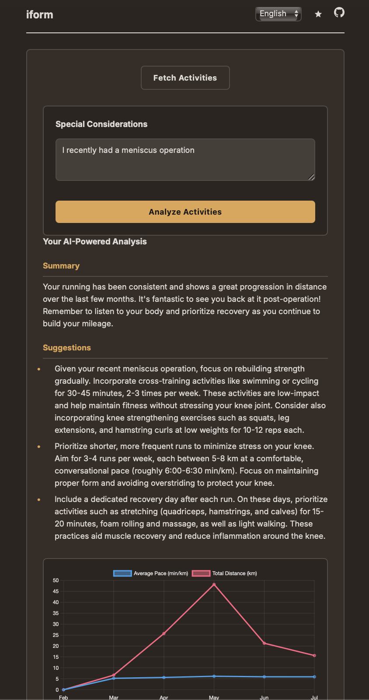

# iform

**"iform"** (Norwegian for "in shape") is a web application designed to provide personalized training insights. It connects to your Strava account, fetches your recent activities, and uses an AI-powered coach to analyze your performance and offer actionable suggestions for improvement.

This project was initially created as a demonstration of the Gemini CLI's capabilities and has evolved into a functional tool for personal training analysis.

## Screenshot



## Features

*   **Strava Integration:** Securely connect your Strava account to fetch your last six months of activity data.
*   **AI-Powered Analysis:** Utilizes a generative AI model to act as a personal running coach, providing:
    *   A summary of your recent training period.
    *   Concrete, actionable suggestions for improvement.
    *   A trend analysis chart visualizing your average pace and total distance over the last six months.
*   **Special Considerations Input:** Provide additional context (e.g., injuries, upcoming events) to the AI for more tailored and safe training suggestions.
*   **Multi-language Support:** The user interface is available in English, Norwegian, and Spanish.
*   **Light & Dark Mode:** Switch between light and dark themes for your viewing preference.

## How It Works

The application consists of a simple frontend and a Node.js backend.

*   **Frontend:** A static web page built with HTML, CSS, and vanilla JavaScript. It handles user interaction, displays data, and renders a trend chart using Chart.js.
*   **Backend:** An Express.js server that manages:
    *   Strava OAuth authentication.
    *   Fetching activities from the Strava API.
    *   Interacting with a generative AI model to analyze the activity data.
    *   Serving language translations.

## Setup and Installation

To run this project locally, you will need to have Node.js installed.

1.  **Clone the repository:**
    ```bash
    git clone https://github.com/torfinnnome/iform.git
    cd iform
    ```

2.  **Install backend dependencies:**
    ```bash
    cd backend
    npm install
    ```

3.  **Configure environment variables:**

    Create a `.env` file in the `backend` directory and add the following, replacing the placeholder values with your actual credentials:

    ```
    STRAVA_CLIENT_ID=your_strava_client_id
    STRAVA_CLIENT_SECRET=your_strava_client_secret
    GOOGLE_API_KEY=your_google_api_key
    REDIRECT_URI=http://localhost:3000/api/strava/callback
    GEMINI_MODEL=gemini-2.0-flash
    SESSION_SECRET=your_very_secret_session_key
    ```

    **Generating a secure `SESSION_SECRET`:**
    For production environments, it is crucial to use a strong, randomly generated string for `SESSION_SECRET`. You can generate one using `openssl`:
    ```bash
    openssl rand -base64 32
    ```
    Replace `your_very_secret_session_key` with the output of this command.

4.  **Start the server:**
    ```bash
    node server.js
    ```

5.  **Open the application:**

    Open your web browser and navigate to `http://localhost:3000`.

## Future Development

Future plans for **iform** include:

*   **Interactive Chat:** A chat interface to interact directly with the AI personal trainer for more dynamic and personalized coaching.
*   **Expanded Data Sources:** Integration with other training data sources beyond Strava.
*   **AI Model Flexibility:** The ability to choose from different AI service providers for analysis.

## Contributing

This is a personal project, but feedback and contributions are welcome. Please feel free to open an issue or submit a pull request.
